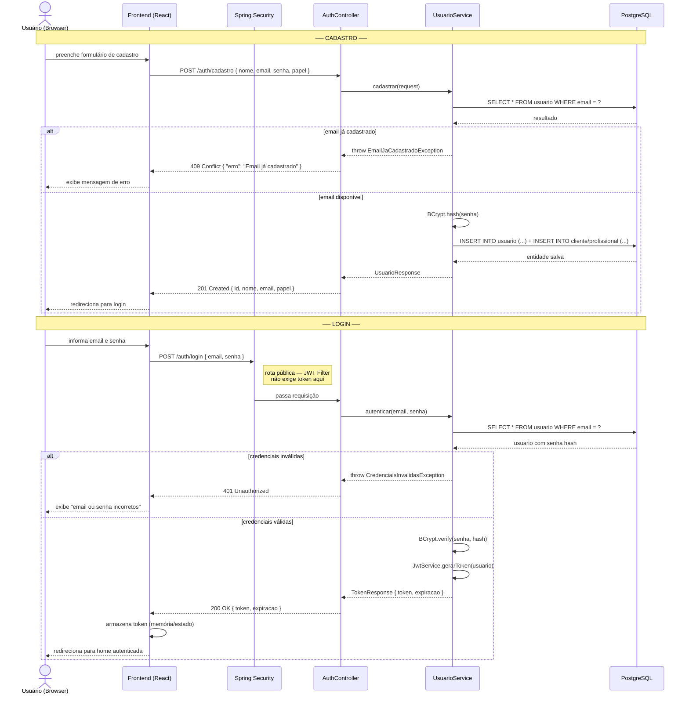
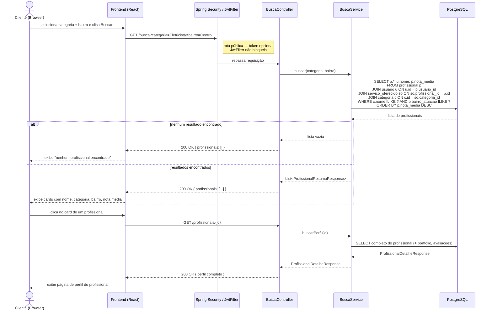
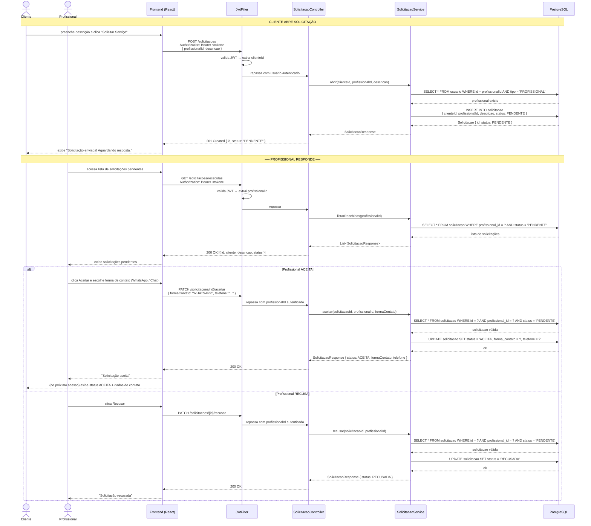
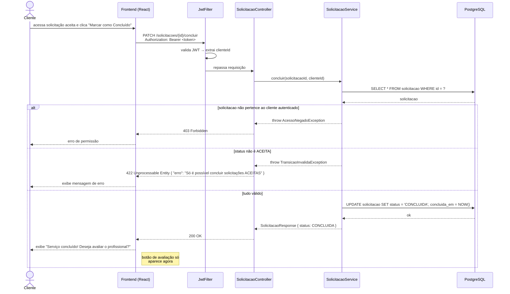
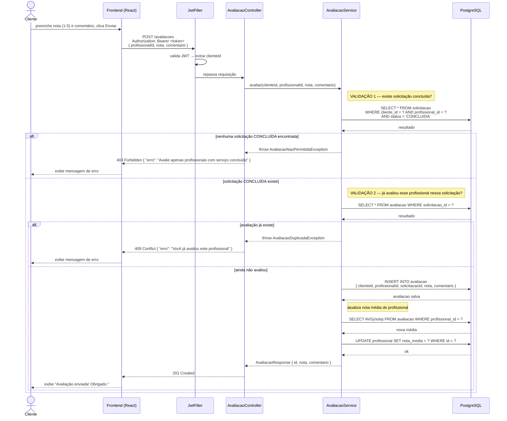

# Diagramas de Sequência — ResolveJá

**Versão:** 1.0  
**Data:** 2026-07-02  
**Etapa:** 5 de 7 — Fluxos Críticos do Sistema

---

## Sumário

1. [Autenticação — Cadastro e Login com JWT](#1-autenticação--cadastro-e-login-com-jwt)
2. [Busca de Profissionais](#2-busca-de-profissionais)
3. [Solicitação de Serviço — Abertura e Resposta do Profissional](#3-solicitação-de-serviço--abertura-e-resposta-do-profissional)
4. [Conclusão de Solicitação](#4-conclusão-de-solicitação)
5. [Avaliação de Profissional](#5-avaliação-de-profissional)

---

## 1. Autenticação — Cadastro e Login com JWT

Este fluxo cobre o registro de um novo usuário e o login retornando um token JWT. O token é usado em todos os demais fluxos no header `Authorization: Bearer <token>`.

---

## 2. Busca de Profissionais

Fluxo de busca por profissionais filtrando por categoria e bairro. Pode ser acessado por usuários não autenticados (busca pública) ou autenticados.

---

## 3. Solicitação de Serviço — Abertura e Resposta do Profissional

Este é o fluxo central do ResolveJá. O Cliente abre uma solicitação, que inicia como `PENDENTE`. O Profissional pode `ACEITAR` (escolhendo a forma de contato) ou `RECUSAR`.

---

## 4. Conclusão de Solicitação

Somente o Cliente pode marcar uma solicitação como `CONCLUÍDA`. A solicitação precisa estar com status `ACEITA`. Esse status é pré-requisito para avaliação (Fluxo 5).

---

## 5. Avaliação de Profissional

Regra de negócio central: o Cliente só pode avaliar se existir uma Solicitação com status `CONCLUÍDA` entre ele e o Profissional. Essa validação é feita no **backend**, não apenas na UI.

---

## Resumo das Regras de Negócio Validadas no Backend

| Fluxo | Regra | Onde é validada |
|---|---|---|
| Login | Senha confere com hash BCrypt | `UsuarioService` |
| Busca | Filtro por categoria + bairro | `BuscaService` (query JPA) |
| Abrir solicitação | Profissional destino existe | `SolicitacaoService` |
| Aceitar/Recusar | Apenas o Profissional da solicitação pode responder | `SolicitacaoService` |
| Aceitar/Recusar | Status deve ser `PENDENTE` | `SolicitacaoService` |
| Concluir | Apenas o Cliente da solicitação pode concluir | `SolicitacaoService` |
| Concluir | Status deve ser `ACEITA` | `SolicitacaoService` |
| Avaliar | Deve existir solicitação `CONCLUÍDA` entre os dois | `AvaliacaoService` |
| Avaliar | Não pode avaliar o mesmo profissional duas vezes (por solicitação) | `AvaliacaoService` |

---

*Documento gerado na Etapa 5 do projeto ResolveJá. Próximas etapas: Contratos de API (06) → Implementação (07).*
